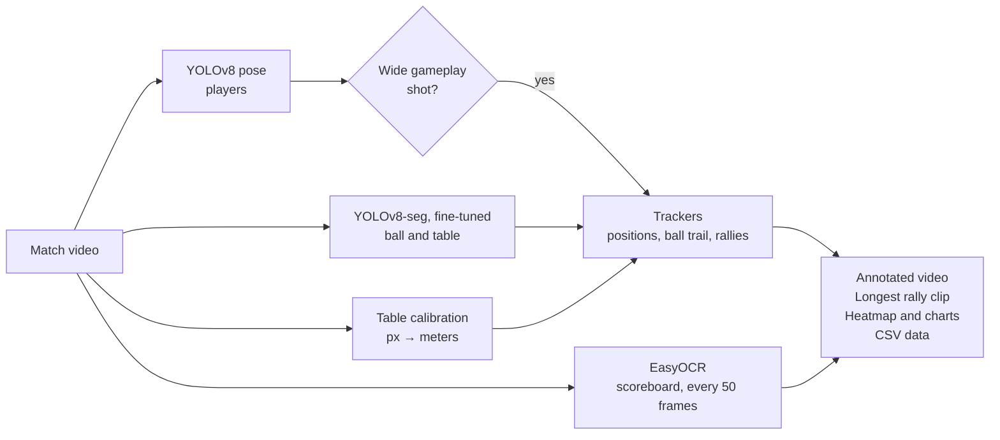

<div align="center">

# 🏓 Table Tennis Analyzer

**Computer vision that turns a table tennis broadcast into match statistics: player tracking, ball speed, rally counting, and scoreboard reading.**


<!-- Add a frame from output_with_detections.mp4 or one of the charts here, e.g.:
 -->

</div>

## About

Give it a match video, and it produces an annotated video, a clip of the longest rally, and a set of charts about the match. It combines two YOLOv8 models (one for the players, one I fine-tuned for the ball and table), OCR for the scoreboard, and geometry that converts pixels into real-world meters.

## Features

- **Player tracking:** a YOLOv8 pose model locates both players in every frame. Their positions become a court heatmap for each player.
- **Custom ball and table detection:** a YOLOv8 segmentation model fine-tuned on a hand-labeled dataset with two classes, `table` and `ball`.
- **Real-world ball speed:** the detected table is used to calibrate a pixels-per-meter scale (a standard table is 2.74 m long), so speed is reported in m/s.
- **Rally counting:** a shot is counted when the ball changes direction after traveling a minimum distance. A rally ends after the ball has been missing for 60 frames. The longest rally is exported as its own clip.
- **Scoreboard reading:** EasyOCR reads the on-screen score every 50 frames to chart how the score develops.
- **Broadcast filtering:** only frames from the wide gameplay camera are analyzed. Replays and close-ups are skipped by checking that two players are detected, far apart, and neither is shown in close-up.

## Pipeline



## Output

| File | Contents |
| --- | --- |
| `output_with_detections.mp4` | Player boxes, ball trail with speed, and a live rally counter |
| `longest_rally.mp4` | The longest rally, cut from the match |
| `player_position_heatmap.png` | Where each player spent the match |
| `rally_chart.png` | Shots per rally, with the average and the longest |
| `score_chart.png` | Score progression read from the scoreboard |
| `ball_speed_chart.png` | Ball speed over time |
| `player_positions.csv`, `ball_positions.csv` | Raw per-frame positions |

## Tech stack

Python · Ultralytics YOLOv8 (pose and segmentation) · OpenCV · EasyOCR · NumPy · Matplotlib

## Running it

```bash
git clone https://github.com/ofriv/-Table-Tennis-Analyzer.git
cd -- -Table-Tennis-Analyzer
pip install -r requirements.txt
python table_tennis_analyzer.py path/to/match.mp4
```

The fine-tuned ball model (`best.pt`) and the dataset images aren't included because of their size. The label files are in `Assignment2_Dataset/`. To train your own model, add the images next to the labels and run `python train_ball_model.py` (YOLOv8n-seg, 50 epochs at 640 px).

EasyOCR uses the GPU by default (`gpu=True`). Set it to `False` if you don't have a CUDA GPU.

## What I'd improve next

- **Configurable scoreboard region.** The OCR crop is currently fixed to the bottom-left of the frame, which matches one broadcast layout.
- **Batched GPU inference** for faster processing of full matches
- **Separate shot counts per player,** by tracking which side of the table the ball changes direction on

## License

[AGPL-3.0](LICENSE). This project uses [Ultralytics YOLOv8](https://github.com/ultralytics/ultralytics), which is AGPL-3.0 licensed, so this project uses the same license.
